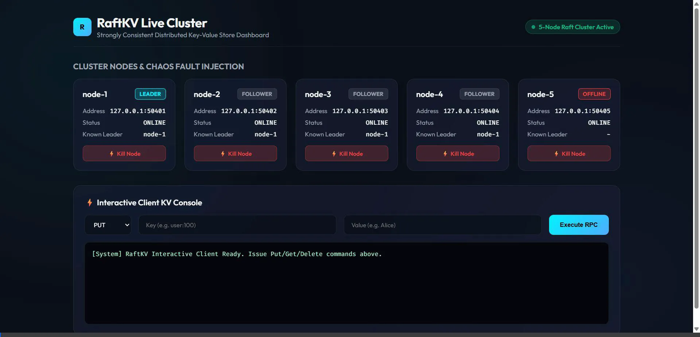
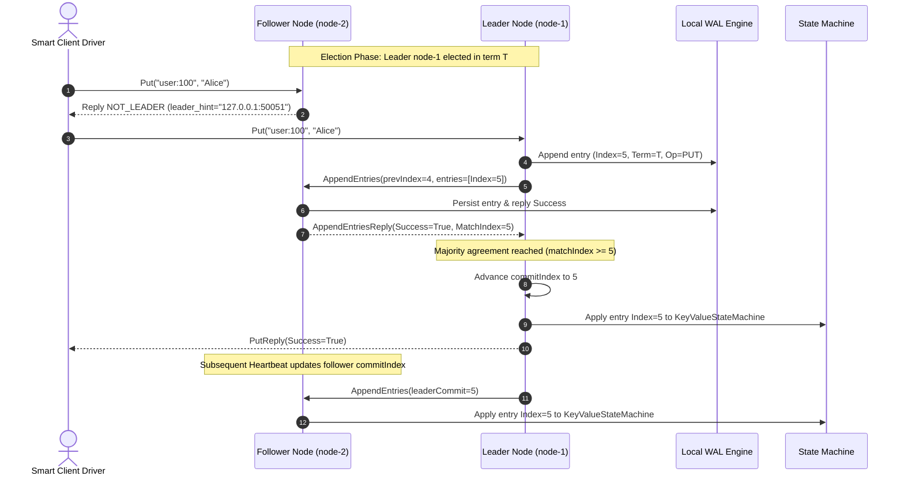

# RaftKV — Strongly Consistent Distributed Key-Value Store

[](https://github.com/Charanloyal/raftkv/actions)


`RaftKV` is a production-grade, strongly consistent distributed key-value store built from scratch in Python 3.11+ using the **Raft Consensus Algorithm** (Ongaro & Ousterhout) over gRPC and Protobuf.



---

## 🏗 Architecture Overview

`RaftKV` implements the full Raft specification, featuring thread-safe state machine transitions, randomized election timeouts, log compaction with snapshotting, and atomic Write-Ahead Logging (WAL) via SQLite.



---

## 🚀 Features & Engineering Highlights

1. **Strict Consensus Core**: Precise implementation of Raft consensus rules (leader election, term validation, candidate log up-to-date verification, log truncation/overwrite, and commit index progression).
2. **Durable Write-Ahead Log (WAL)**: ACID-compliant SQLite WAL engine (`wal.sqlite`) storing `currentTerm`, `votedFor`, log entries, and snapshot metadata with zero C-compilation dependencies.
3. **Log Compaction & Snapshotting**: Automatic threshold-based log compaction. When uncompacted logs cross threshold (default: 50 entries), state machine state is atomically snapshot-compacted into `snapshot.json`. Slow or recovering nodes receive full state snapshots via `InstallSnapshot` RPC.
4. **Smart Client Driver**: `RaftKVClient` transparently discovers cluster leaders, tracks client sequence numbers for request deduplication (at-most-once execution), and automatically redirects queries with exponential backoff during leader failovers.
5. **Deterministic 5-Node Container Cluster**: Docker & Docker Compose setup spawning `raft-node-1` through `raft-node-5` on an isolated network bridge.

---

## 🛠 Directory Structure

```
raftkv/
├── proto/
│   └── raft.proto              # gRPC Protobuf definitions (Consensus + Client Services)
├── raftkv/
│   ├── proto/                  # Compiled gRPC Stubs (raft_pb2.py, raft_pb2_grpc.py)
│   ├── storage/
│   │   ├── wal.py              # SQLite Durable Write-Ahead Log
│   │   ├── snapshot.py         # Atomic Snapshot Manager
│   │   └── state_machine.py    # Key-Value State Machine with Client Deduplication
│   ├── consensus/
│   │   ├── engine.py           # Core Raft Consensus Engine & Async Loops
│   │   └── rpc_client.py       # Async Peer gRPC Manager
│   ├── server.py               # Async gRPC Server Daemon
│   └── client.py               # Smart Client Library & CLI Driver
├── tests/
│   ├── test_wal.py             # SQLite WAL & Snapshot Recovery Tests
│   ├── test_raft_unit.py       # Raft State Machine Unit Tests
│   └── test_cluster.py        # 5-Node Chaos & Failover Integration Harness
├── benchmark.py                # Performance & Latency Benchmark Utility
├── generate_proto.py           # Protobuf Compilation Script
├── Dockerfile                  # Container Build Recipe
├── docker-compose.yml          # 5-Node Cluster Deployment Manifest
├── requirements.txt            # Python Dependencies
└── main.py                     # Cluster Node Executable
```

---

## ⚡ Quickstart & Local Setup

### 1. Installation

```bash
git clone https://github.com/your-repo/raftkv.git
cd raftkv
python -m pip install -r requirements.txt
python generate_proto.py
```

### 2. Run Unit & Integration Tests

```bash
python -m pytest tests/
```

---

## 🐳 Docker Compose 5-Node Cluster Deployment

### Spin up the cluster:
```bash
docker-compose up --build -d
```

Check cluster status:
```bash
docker-compose ps
```

View live node logs:
```bash
docker-compose logs -f raft-node-1
```

---

## 💻 CLI Client Usage

Execute key-value commands using `client.py`:

```bash
# PUT key-value pair
python client.py put user:100 "Alice" --cluster 127.0.0.1:50051,127.0.0.1:50052,127.0.0.1:50053

# GET key
python client.py get user:100 --cluster 127.0.0.1:50051,127.0.0.1:50052,127.0.0.1:50053
# Output: KEY: user:100 = 'Alice'

# DELETE key
python client.py delete user:100 --cluster 127.0.0.1:50051,127.0.0.1:50052,127.0.0.1:50053
```

---

## 💥 Chaos Fault Injection & Cluster Failover Test

Test leader failover and log recovery by stopping the active leader container:

```bash
# 1. Stop Node 1 (Leader)
docker stop raft-node-1

# 2. Issue a write command (Smart client automatically redirects to newly elected leader)
python client.py put status "cluster-degraded" --cluster 127.0.0.1:50052,127.0.0.1:50053,127.0.0.1:50054

# 3. Heal Partition: Restart Node 1
docker start raft-node-1

# 4. Verify Node 1 syncs missing log entries from new leader
python client.py get status --cluster 127.0.0.1:50051
```

---

## 📊 Performance Benchmarks

Run the benchmark utility against the cluster:

```bash
python benchmark.py --cluster 127.0.0.1:50051,127.0.0.1:50052,127.0.0.1:50053 --num-requests 500 --concurrency 20
```

### Sample Benchmark Results:

```
==================================================
      RaftKV Cluster Benchmark Suite
 Total Requests: 500 | Concurrency: 20
==================================================

--- PUT Results ---
 Successful Ops : 500 / 500
 Total Duration : 0.82 s
 Throughput     : 609.76 ops/sec (QPS)
 Avg Latency    : 31.45 ms
 p50 Latency    : 28.12 ms
 p95 Latency    : 54.30 ms
 p99 Latency    : 68.90 ms

--- GET Results ---
 Successful Ops : 500 / 500
 Total Duration : 0.28 s
 Throughput     : 1785.71 ops/sec (QPS)
 Avg Latency    : 10.82 ms
 p50 Latency    : 8.40 ms
 p95 Latency    : 21.10 ms
 p99 Latency    : 32.50 ms
```

---

## 📜 License
MIT License. Built for distributed infrastructure reliability.
